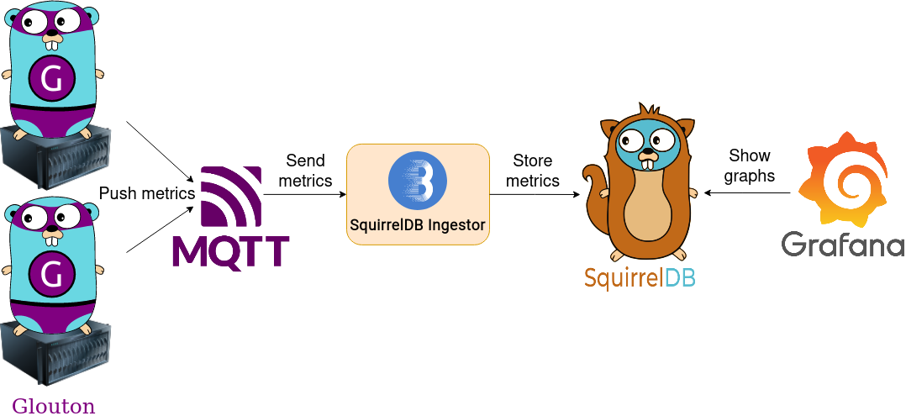

# Bleemeo Monitoring Solution Community Edition



The **Bleemeo Community Edition** is the Open Source and self hosted version of
the Bleemeo monitoring solution.

Deploying a robust, scalable monitoring solution can be time consuming. At
Bleemeo, we focus on making users life easier. Check out the solution we offer
on our [website](https://bleemeo.com) and try it now for free!

- **Prometheus compatible**
  > Glouton exposes a Prometheus metric endpoint and SquirrelDB supports remote
  > Prometheus storage and PromQL queries.
- **Robust and horizontally scalable**
  > SquirrelDB and the Ingestor are designed to be scalable.
- **Push model**
  > A push model instead of the Prometheus pull model makes data collection more
  > firewall friendly and easier to scale.
- **Secure**
  > All communications can be **encrypted** and **authenticated**.

It is composed of three main components:

- [Glouton](https://bleemeo.com/glouton/): a powerful **monitoring agent**, that
  exposes relevant metrics about your system and all services and containers
  running on your server.
- [SquirrelDB](https://bleemeo.com/squirreldb/): a scalable and highly available
  **timeseries database**.
- [SquirrelDB Ingestor](https://github.com/bleemeo/squirreldb-ingestor):
  **forward metrics** sent by Glouton over [MQTT](https://mqtt.org/), a standard
  messaging system, to SquirrelDB.

And some third party components:

- [Cassandra](https://cassandra.apache.org): a **distributed database** used for
  SquirrelDB long term storage.
- [NATS](https://nats.io/): a **high-performance messaging system** used as a
  MQTT broker by Glouton to send its metrics.
- [Grafana](https://grafana.com/): display the metrics and provide **alerting**.

This repository provides two docker compose to test the Bleemeo Community
Edition:

- a [quick start](#quick-start)
- a [high availability setup](#high-availability)

Check the [documentation](https://docs.bleemeo.com/community) to see how to
deploy the Bleemeo Community Edition in production.

## Quick Start

The quick start setup deploys one of each component: Glouton, SquirrelDB,
Cassandra, SquirrelDB Ingestor, NATS and Grafana.

```shell
cd base
docker-compose up -d
```

Then go to http://localhost:3000 (default credentials are admin/admin) and:

- add a Prometheus datasource (using http://squirreldb:9201 as URL)
- create your dashboard or import one (for example import node exporter
  dashboard with ID 1860).

## High Availability

The high availability docker compose provides:

- a Cassandra cluster with 3 nodes
- a Redis cluster with 6 nodes
- 2 SquirrelDB behind a load balancer (nginx)
- a NATS cluster with 3 nodes
- 2 SquirrelDB Ingestors
- 2 Glouton

Due to some components not liking to change their IP address, they are fixed and
use the subnet 172.29.0.0/16. If this conflict with one of your existing
network, update the docker-compose file to change this subnet.

```shell
cd high-availability
docker-compose up -d
```

Then go to http://localhost:3000 (default credentials are admin/admin) and:

- add a Prometheus datasource (using http://squirreldb:9201 as URL)
- create your dashboard or import one (for example import node exporter
  dashboard with ID 1860).

Note that this is only for testing since all components will run on the same
machine.

See the
[High Availability documentation](https://docs.bleemeo.com/community/high-availability)
for details on how to deploy this setup in production.
